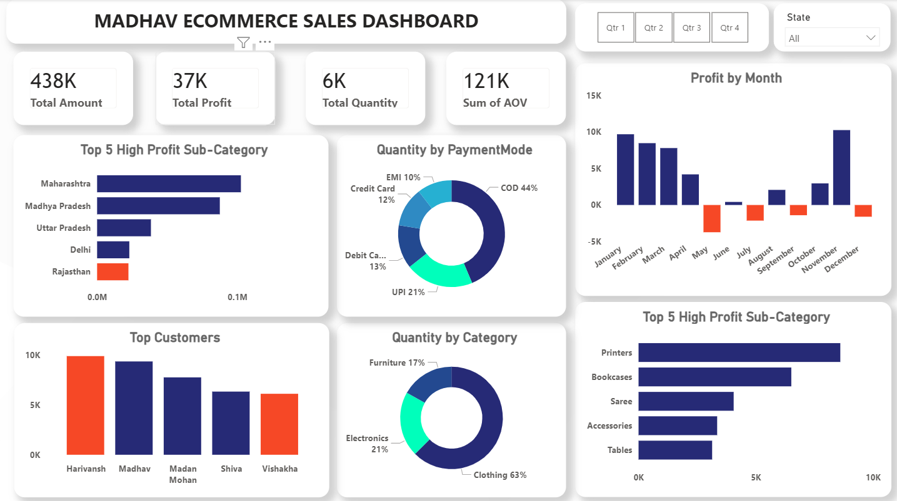

# 🛒 E-Commerce Sales Analysis — Power BI Dashboard

A Power BI dashboard built to investigate why an e-commerce business was generating strong revenue but very low profit — and to uncover what was actually driving (or hurting) the numbers.

---

## 📌 About the Project

This dashboard analyzes order-level e-commerce sales data across product categories, payment modes, states, and customers. The core question I wanted to answer was simple: revenue is ₹438K — so why is profit only ₹37K? The dashboard is designed for anyone who wants to understand business performance beyond just top-line numbers — whether that's a business owner, a sales manager, or a fellow analyst learning Power BI.

---

## 🛠️ Tech Stack

| Tool | Purpose |
|---|---|
| 📊 Power BI Desktop | Main platform for building the dashboard and visuals |
| 📂 Power Query | Data cleaning and transformation before loading |
| 🧠 DAX | Calculated measures for KPIs like profit margin and AOV |
| 📐 Data Modeling | Star schema — fact table connected to dimension tables |
| 📁 File Format | `.pbix` for development, `.png` for dashboard previews |

---

## 📁 Data Source

**Source:** Excel file with order-level e-commerce transaction data

The dataset included:
- Revenue and profit per order
- Product categories — Clothing, Electronics, Furniture
- Payment modes — COD, UPI, Credit Card, Debit Card, EMI
- State-wise customer locations across India
- Individual customer purchase history

---

## 🔍 Highlights

### 🔴 Business Problem

The business had ₹438K in revenue but only ₹37K in profit — a margin of roughly 8.4%. That gap raised real questions:

- Which categories are actually profitable?
- Is the discount strategy hurting margins?
- Are certain states or customers dragging performance down?
- Why is Cash on Delivery still the dominant payment mode?

Raw data alone could not answer these. The dashboard was built to make these patterns visible.

---

### 🎯 Goal of the Dashboard

To build an interactive view of the business that helps answer:

- Where is profit being lost?
- Which segments are high risk?
- What should the business fix first?

---

### 📊 Walkthrough of Key Visuals

**KPI Cards (Top Section)**

| Metric | Value |
|---|---|
| Total Revenue | ₹438K |
| Total Profit | ₹37K |
| Total Quantity Sold | 5,615 |
| Average Order Value | ₹121K |
| Profit Margin | ~8.4% |

**Monthly Profit Trend**
Shows profit month by month. Multiple months are negative — May has the biggest dip. Useful for spotting seasonal patterns or months where discounting went too far.

**Category Sales Breakdown**
Clothing accounts for 63% of quantity sold. Electronics and Furniture together make up the remaining 37%. The dependency on one category is immediately visible here.

**Payment Mode Distribution**
COD sits at 44% of all transactions. UPI, cards, and EMI split the rest. This visual makes the cash flow risk easy to see at a glance.

**State-wise Performance**
Profit contribution varies sharply across states. A few states contribute heavily while others barely break even — pointing to either logistics cost issues or weak demand in those regions.

**Customer Revenue Concentration**
A small set of customers is responsible for a disproportionate share of revenue. The long tail is very flat — most customers transact rarely.

---

### 💡 Business Impact and Insights

- **Margin problem is real** — 8.4% is too low for a sustainable e-commerce business. Pricing and discount strategy need a review.
- **Category risk** — 63% dependence on clothing means one bad season hits the whole business. Electronics and Furniture need attention.
- **COD reduction opportunity** — Shifting even 20% of COD customers to prepaid would reduce returns and improve cash flow.
- **Customer retention priority** — With revenue concentrated in a few accounts, losing one or two top customers would be painful. Loyalty programs make sense here.
- **Regional focus** — Underperforming states should be reviewed before further marketing investment goes in.

---

## 📸 Dashboard Preview



---

## 📂 Project Structure

```
ecommerce-powerbi-dashboard/
├── Ecommerce Power BI Project.pbix
├── Data/
│   └── Details.csv
    └── Orders.csv
├── Screenshots/
│   └── Dashboard.png
└── README.md
```

---

## 🙋 Connect with Me

This is part of my ongoing Power BI learning journey. If you have feedback on the analysis, the visuals, or anything else — I'd genuinely like to hear it.

- 🔗 LinkedIn: [linkedin.com/in/tarun-kumar-5b9280396](https://linkedin.com/in/tarun-kumar-5b9280396)
- 💻 GitHub: [github.com/tarunkumar7906](https://github.com/tarunkumar7906)

---

*Still learning. Open to feedback.*
